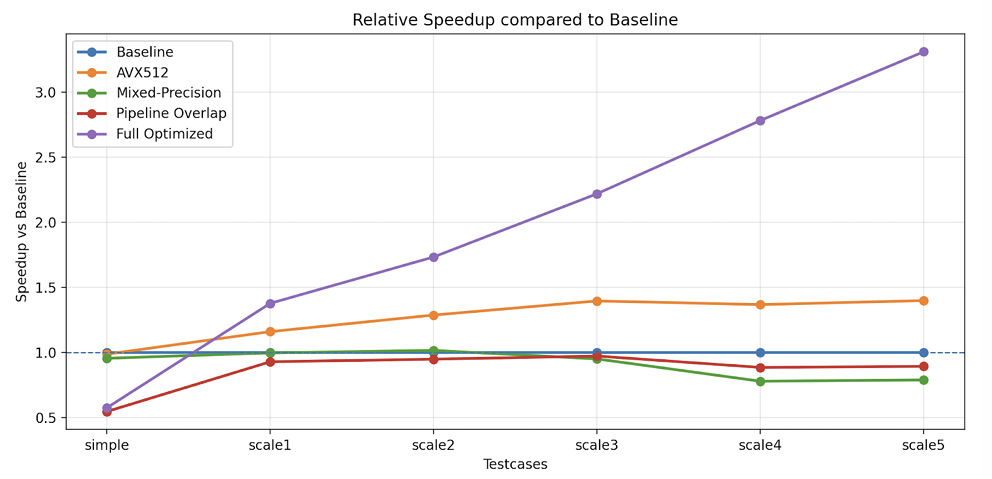
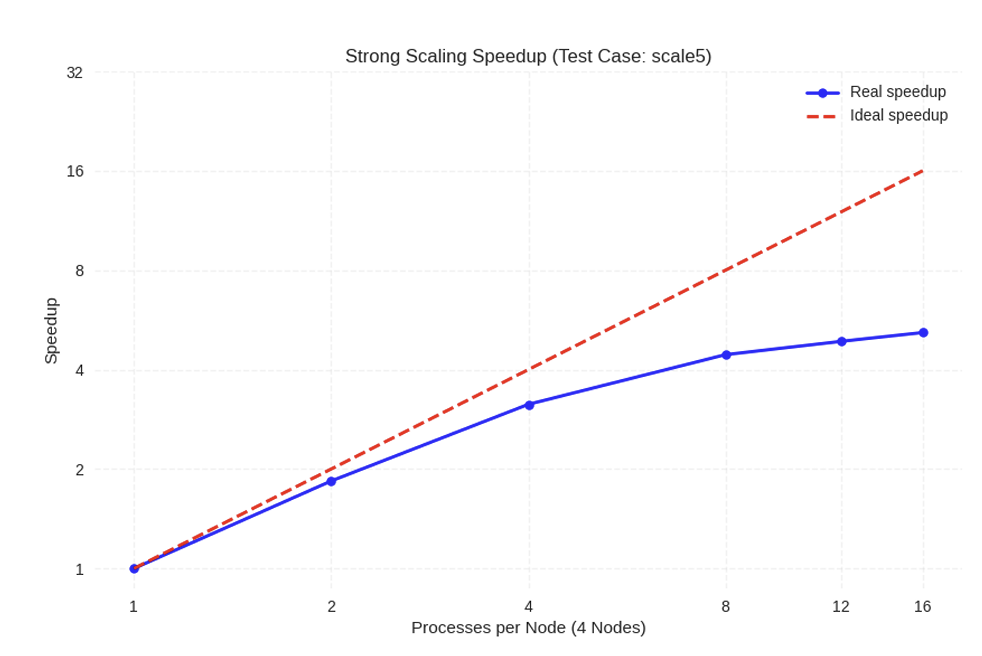
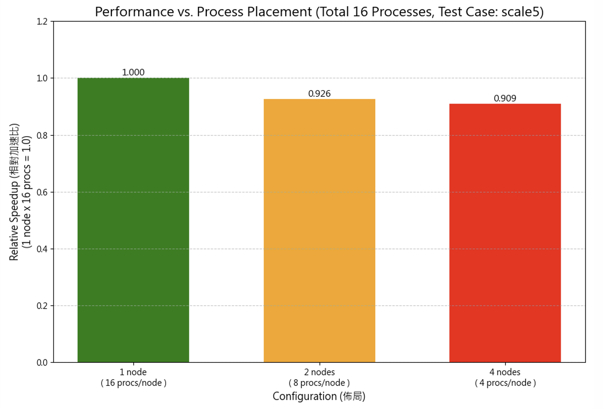

# **Standard Scaled Dot-Product Attention with MPI**

## Project Goal

This project implements and optimizes the **Standard Scaled Dot-Product Attention** mechanism using **MPI-based distributed parallelism**.
The objective is to accelerate large-scale matrix-based attention computation by leveraging **data parallelism, communication overlap, and SIMD vectorization (AVX-512)** across multi-node CPU clusters.

---

## Problem Definition

The task computes:

$$
\text{Attention}(Q, K, V)
= \text{softmax}\left( \frac{QK^T}{\sqrt{d_k}} \right)V
$$

where

- \( Q \in \mathbb{R}^{m \times d_k} \)
- \( K \in \mathbb{R}^{n \times d_k} \)
- \( V \in \mathbb{R}^{n \times d_v} \)

Each row of ( Q ) attends to all rows of ( K ), followed by a weighted combination of ( V ) through softmax normalization.

The project includes:

1. A **serial version (`attention.c`)** as the correctness baseline.
2. An **optimized MPI-parallelized version (`attention-mpi.c`)** with multiple layers of optimization.

---

## Optimization Overview

Our acceleration strategy focuses on **three dimensions**:
1. memory and data locality, 
2. computation vectorization, 
3. communication/computation overlap.

### 1. Memory & Data Locality Optimization

| Technique                                     | Description                                                                                                                                                                                                         |
| --------------------------------------------- | ------------------------------------------------------------------------------------------------------------------------------------------------------------------------------------------------------------------- |
| **Owner-based Data Partitioning**             | Functions `owner_count()` and `owner_disp()` divide K/V matrices across MPI ranks to ensure load balance and local data access.                                                                                     |
| **Adaptive Distribution (Bcast vs Scatterv)** | A dynamic threshold (64 MB) determines communication mode: <br>• **Bcast** for small data → faster due to prebuilt tree topology.<br>• **Scatterv** for large data → memory efficient, sending only local segments. |
| **Prefetching**                               | `_mm_prefetch()` preloads upcoming K/V blocks into cache during softmax to reduce latency.                                                                                                                          |

---

### 2. Vectorized Compute & Mixed Precision

| Component                               | Function                            | Key Idea                                                                                                                                                                                                  |
| --------------------------------------- | ----------------------------------- | --------------------------------------------------------------------------------------------------------------------------------------------------------------------------------------------------------- |
| **Type Conversion**                     | `cvt_d2f_avx512` / `cvt_f2d_avx512` | Converts data between `double` and `float` using AVX-512, processing 32 elements per iteration with loop unrolling and masked tail handling. Enables **mixed-precision** (float compute + double output). |
| **Vectorized Dot Product**              | `dot_avx512()`                      | Core of ( QK^T ): uses `_mm512_fmadd_ps` with 4 accumulators (64 elements per iteration) and `_mm512_reduce_add_ps` for horizontal summation.                                                             |
| **Vectorized AXPY**                     | `axpy_avx512()`                     | Performs `y += αx` using FMA for softmax-weighted accumulation of `V`.                                                                                                                                    |
| **Vectorized Scaling / Initialization** | `memset_zero_scale()`               | Fills or scales vectors using AVX-512 (`_mm512_setzero_ps`, `_mm512_mul_ps`) to accelerate zeroing and normalization steps.                                                                               |
| **Online Softmax**                      | `online_softmax_attention()`        | Implements numerically stable online softmax (tracking `rmax` and `rsum`) while prefetching next K/V rows.                                                                                                |

---

### 3. Communication & Pipeline Overlap

| Mechanism                          | Description                                                                                                                                                                                                   |
| ---------------------------------- | ------------------------------------------------------------------------------------------------------------------------------------------------------------------------------------------------------------- |
| **Two-Phase Global Normalization** | Softmax computed in two global steps:<br>1️ `MPI_Iallreduce(..., MPI_MAX, ...)` for global max.<br>2️ `MPI_Iallreduce(..., MPI_SUM, ...)` for global sum.<br>Ensures stable normalization across all ranks. |
| **Non-blocking Communication**     | Uses `MPI_Ibcast` and `MPI_Ireduce` for asynchronous communication to overlap data transfer and computation.                                                                                                  |
| **Ping-Pong Buffers**              | Two alternating buffers for Q (broadcast batches) and contrib (reduction results), ensuring continuous computation while previous batch communications complete.                                              |
| **Pipeline Design**                | Overlaps computation and MPI communication:<br>prefetch next Q batch → compute current → reduce previous.                                                                                                     |

---

## Implementation Files

| File                  | Description                                                                                                                                                                            |
| --------------------- | -------------------------------------------------------------------------------------------------------------------------------------------------------------------------------------- |
| **`attention.c`**     | Serial baseline implementation. Straightforward nested loops over Q, K, and V with row-wise softmax. Used for correctness validation and performance comparison.                       |
| **`attention-mpi.c`** | Fully optimized MPI implementation with mixed precision, AVX-512 vectorization, adaptive data distribution, and communication overlap. Includes all described optimization techniques. |

---

## Performance Summary

### Experimental Setup

* **4 Nodes × 16 Processes/Node (Total 64 Processes)**
* CPU: Intel Xeon Gold (AVX-512 support)
* Network: Mellanox ConnectX-5 (UCX enabled)

### Key Results



| Testcase | AVX512 | Mixed Precision | Pipeline Overlap | Full Optimized |
| -------- | ------ | --------------- | ---------------- | -------------- |
| Simple   | 0.99×  | 0.96×           | 0.55×            | 0.58×          |
| Scale1   | 1.16×  | 1.00×           | 0.93×            | 1.38×          |
| Scale2   | 1.29×  | 1.02×           | 0.95×            | 1.73×          |
| Scale3   | 1.40×  | 0.95×           | 0.97×            | 2.22×          |
| Scale4   | 1.37×  | 0.78x           | 0.89×            | 2.78×          |
| Scale5   | 1.40×  | 0.79×           | 0.89×            | **3.31×**      |

**Highlights:**

* **AVX512 + Loop Unrolling:** Sustained 1.3–1.4× speedup across scales.
* **Mixed Precision:** Reduced memory bandwidth and improved throughput.
* **Pipeline Overlap:** Hides communication latency in large workloads.
* **Full Integration:** Achieved up to **3.3×** overall speedup on large-scale inputs.

---

## Scalability Insights

* **Strong Scaling:** Near-linear up to 8 processes/node; saturation after 16 due to communication-bound regime.

* **Weak Scaling:** Maintains horizontal trend up to 8 nodes, indicating balanced workload distribution.

* **Node Distribution Impact:** Performance drops (≈ 10%) when splitting processes across more nodes due to higher inter-node latency.


More performance analysis can be found in report.

---

## Compilation & Execution

### Build

```bash
mpicc attention-mpi.c -o attention-mpi -lm -march=native
```

### Run

```bash
UCX_TLS=rc,sm,self \
UCX_NET_DEVICES=mlx5_0:1 \
mpirun --hostfile hosts --map-by ppr:16:node \
--mca pml ucx --mca btl ^tcp \
./attention-mpi <testing_data.bin>
```

---

## References

* Open MPI v4.1 Documentation
* Intel AVX-512 Intrinsics Reference
* [Wikipedia: Scaled Dot-Product Attention](https://en.wikipedia.org/wiki/Attention_%28machine_learning%29#Scaled_dot-product_attention)
* [MPI Tutorial](https://mpitutorial.com/tutorials/)

---

## Conclusion

This project demonstrates a **multi-level optimization pipeline** that effectively accelerates attention computation under an MPI cluster.
Through **AVX-512 vectorization**, **mixed-precision compute**, and **overlapped communication**, we achieve up to **3.3× speedup** over the baseline while maintaining correctness within ±0.02 tolerance.
The approach exemplifies efficient **hybrid optimization** combining compute throughput, memory locality, and distributed synchronization — a model for scalable deep learning operators on CPU clusters.

